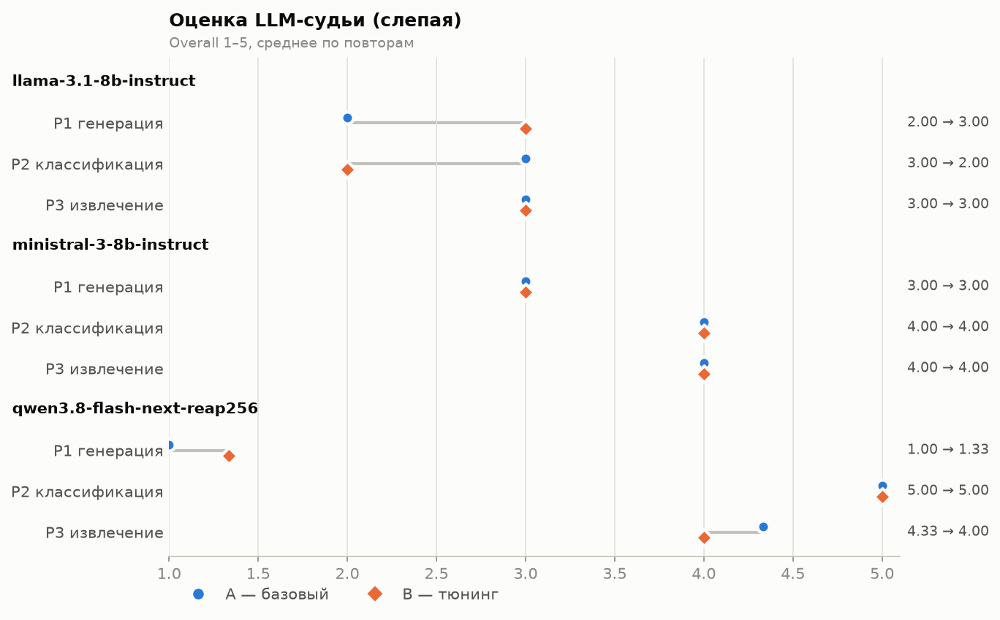
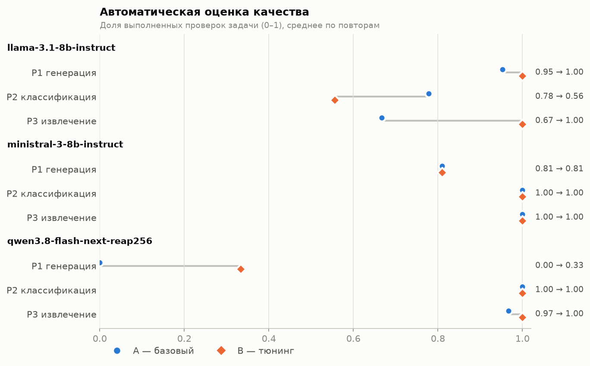
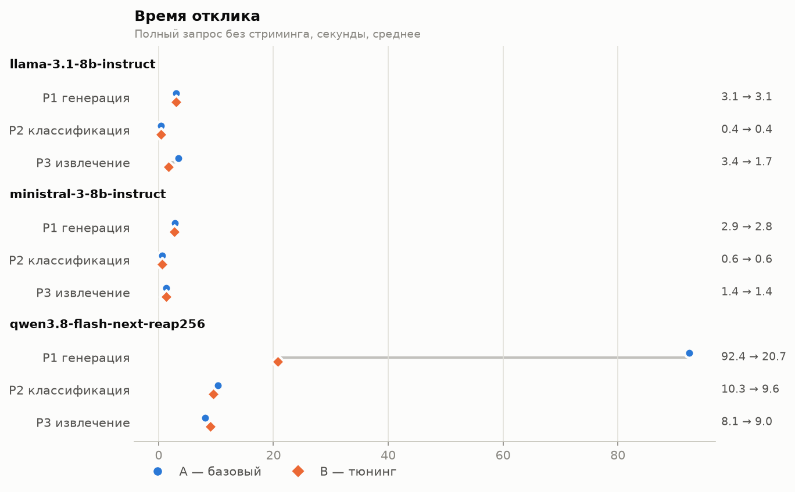

# Лабораторная работа №1 — Развёртывание и эмпирический анализ LLM

## Описание задания

Развернуть три LLM из разных семейств (Qwen, Llama, Mistral) с OpenAI-совместимым REST API,
прогнать на каждой три разнотипных промпта на русском языке (генерация, классификация,
извлечение) в двух режимах — **A (базовый, дефолты движка)** и **B (тюнинг гиперпараметров)** —
и провести эмпирический анализ: длина ответа, точность, стабильность, повторяемость,
галлюцинации, время отклика, число токенов, скорость токенизации и генерации.

## Использованные технологии и модели

**Железо:** AMD Ryzen 9 9950X (16C/32T), 64 GB DDR5-6000, NVIDIA RTX 5070 12 GB, NVMe SSD.

**Движок:** [llama.cpp](https://github.com/ggml-org/llama.cpp) `llama-server` b11524 (CUDA 12.8),
OpenAI-совместимый endpoint `POST /v1/chat/completions`.

| Семейство | Модель | Квантование | Размер | Размещение |
|---|---|---|---|---|
| Qwen | Qwen3.8-Flash-Next **REAP-256** (MoE, 116.5B, 512 → 256 экспертов, top-10 + 1 shared) | UD-Q3_K_XL (Unsloth Dynamic, ~3 бит) | 57.7 GiB | `--fit`: плотные веса и эксперты 5 слоёв на GPU, эксперты 43 слоёв в RAM, `per_layer_token_embd` — mmap с SSD |
| Llama | Llama-3.1-8B-Instruct | Q4_K_M | 4.6 GiB | целиком на GPU |
| Mistral | Ministral-3-8B-Instruct-2512 | Q4_K_M | 4.8 GiB | целиком на GPU |

**Как Qwen на 116B параметров помещается в 12 GB VRAM + 64 GB RAM.** REAP-прунинг оставляет
половину экспертов (256 из 512), квантование ~3 бит сжимает модель до 57.7 GiB. Почти половина
файла — n-gram таблица эмбеддингов `per_layer_token_embd` (26.8 GiB, 160 × 320M строк): на каждый
токен из неё читается лишь несколько строк, поэтому она остаётся в mmap и подкачивается с NVMe по
требованию. Рабочий набор — ~26 GiB экспертов (RAM + VRAM) и ~4 GiB плотных весов (GPU).
Декодирование упирается в пропускную способность RAM; число потоков подобрано `llama-bench`
(`source/results/bench_threads.md`): 8 → 31.0, **12 → 33.3**, 16 → 32.1 ток/с.

**Python:** стандартная библиотека (`urllib`) для REST-клиента, анализа и оценки;
`matplotlib` — графики, `pytest` — тесты оценщиков.

## Методика

### Промпты (`source/config.py`)

- **P1 — генерация:** вежливое письмо клиенту о задержке заказа № 48213 на 3 рабочих дня,
  промокод SORRY10 (10 %, до 31 декабря), e-mail поддержки, 120–180 слов, без выдуманных фактов,
  подпись «Команда ТехноМир».
- **P2 — классификация:** 9 коротких обращений → метки `["Billing", "Tech support", "Sales"]`,
  ответ — только JSON-массив; есть эталонная разметка.
- **P3 — извлечение:** описание смартфона → JSON из 10 полей; ловушки: «1 год» → 12 месяцев,
  вес в тексте отсутствует (`null`, любое число — галлюцинация).

### Режимы

| | P1 генерация | P2 / P3 структурные |
|---|---|---|
| **A — базовый** | в запросе нет ни одного параметра сэмплинга (дефолты llama-server и GGUF) | то же |
| **B — тюнинг** | `temperature=0.7, top_p=0.9, top_k=40, repeat_penalty=1.1, max_tokens=1024` | `temperature=0, top_p=1, top_k=1, repeat_penalty=1.0, max_tokens=1024` |

Дефолты в режиме A: llama-server — `temperature=0.8, top_k=40, top_p=0.95`, без лимита токенов;
Qwen берёт рекомендованные значения из метаданных GGUF — `temperature=1.0, top_k=20, top_p=0.95`.

Каждая комбинация модель × промпт × режим прогоняется **3 раза** (54 ответа). Кэш префикса
отключён (`cache_prompt: false`), перед замерами — прогревочный запрос. Для Qwen в обоих режимах
задан `reasoning_effort: low` (параметр шаблона чата, не сэмплинга): по умолчанию `xhigh`.

### Метрики (`source/analyze.py`, `source/judge.py`)

| Метрика | Источник |
|---|---|
| Токены ввода / вывода | `usage.prompt_tokens / completion_tokens` (у Qwen — вместе с рассуждением) |
| Время отклика | wall-clock полного запроса |
| Скорость prefill / генерации | `timings.prompt_per_second / predicted_per_second` llama-server |
| Скорость токенизации | отдельный `POST /tokenize` по тексту промпта |
| Точность (авто) | P1 — 7 проверок фактов и длины; P2 — доля верных меток; P3 — доля верных полей |
| Точность / галлюцинации (LLM-судья) | слепая оценка 1–5 по критериям задачи + флаг `hallucination` |
| Стабильность | число уникальных ответов из 3 и средняя попарная похожесть (difflib) |
| Повторяемость внутри ответа | доля повторяющихся словесных 3-грамм в ответе (`rep3`) и в рассуждении (`rep3_r`) |

**LLM-as-a-judge.** Ответы всех моделей перемешаны и обезличены (`results/judge/*.md`), судья
оценивает их без информации о модели и режиме; соответствие id → прогон хранится в
`mapping.json` и применяется только при сведении (`judge.py report`). Для P2 судья сначала
размечает обращения сам, его разметка совпала с эталонной 9/9.

## Результаты работы

Все прогоны: `source/results/runs.jsonl`. Сводные таблицы: `source/results/summary.md`
(авто-метрики), `source/results/judge/report.md` (оценки судьи с комментариями в
`results/judge/scores.jsonl`).

### Скорость

| Модель | Генерация, ток/с | Prefill, ток/с | Токенизация, ток/с | Время `/tokenize`, мс | Среднее время отклика, с |
|---|---|---|---|---|---|
| Llama-3.1-8B | 107.6 | 4 310 | ~250 000 | 0.9 | 2.0 |
| Ministral-3-8B | 98.5 | 4 374 | ~195 000 | 1.2 | 1.6 |
| Qwen3.8-Flash-Next REAP-256 | 34.3 | 186 | ~203 000 | 1.0 | 25.0 |


- Модели 8B целиком на GPU: ~100 ток/с генерации и ~4.3k ток/с prefill. Режим почти не влияет на
  скорость: она определяется размещением весов, а не сэмплингом.
- Qwen генерирует в ~3 раза медленнее (эксперты 43 слоёв считаются на CPU), а prefill в ~23 раза
  медленнее: на коротких промптах (~250 токенов) он упирается в CPU-экспертов. В `llama-bench`
  на 256 токенах prefill — ~400 ток/с.
- Токенизация на всех моделях занимает ~1 мс на промпт (основная часть — HTTP-накладные), то есть
  пренебрежимо мала по сравнению с prefill и генерацией.
- У Ministral в 3 раза больше входных токенов (717 против 207 на P1): шаблон чата добавляет
  длинный системный промпт по умолчанию.

### Качество

| Модель | Режим | P1 авто | P1 судья | P2 авто | P2 судья | P3 авто | P3 судья |
|---|---|---|---|---|---|---|---|
| Llama-3.1-8B | A | 0.95 | 2.0 | 0.78 | 3.0 | 0.67 | 3.0 |
| Llama-3.1-8B | B | 1.00 | 3.0 | 0.56 | 2.0 | 1.00 | 3.0 |
| Ministral-3-8B | A | 0.81 | 3.0 | 1.00 | 4.0 | 1.00 | 4.0 |
| Ministral-3-8B | B | 0.81 | 3.0 | 1.00 | 4.0 | 1.00 | 4.0 |
| Qwen3.8 REAP-256 | A | 0.00 | 1.0 | 1.00 | 5.0 | 0.97 | 4.3 |
| Qwen3.8 REAP-256 | B | 0.33 | 1.3 | 1.00 | 5.0 | 1.00 | 4.0 |

Авто — доля пройденных проверок (0–1); судья — overall (1–5), среднее по 3 повторам.




**P1 — генерация.**
- **Llama:** автопроверки проходят почти всегда (0.95–1.00), но судья находит пропуск срока
  «3 рабочих дня» в 3 из 6 писем (в одном — плейсхолдер `[предполагаемая дата поставки]`) и слабый
  язык: англицизмы (`slightly`, `SMALL`, `soon`), ошибки согласования. В режиме A чаще выдумывает
  детали: условие «покупка от 1000 рублей», обещание, что «подобное не повторится» (галлюцинации
  в 2 из 3 писем против 1 из 3 в режиме B).
- **Ministral:** лучший тон и грамотность, но в 5 из 6 писем искажено название магазина:
  `Техн[TOOL_CALLS]�ир`, `Технчиер`, `Техномври`, `Техновин`. В выход протекает служебный токен
  `[TOOL_CALLS]` и битый UTF-8, причём в обоих режимах — это дефект токенизации кириллицы
  квантованной модели, а не сэмплинга. Однажды вместо срока доставки — плейсхолдер
  `[уточняемая дата]`, однажды искажено имя клиента («Петровна»).
- **Qwen:** провал в обоих режимах — ни одного письма на русском. 3 из 6 ответов пустые, остальные —
  испанский текст или черновики рассуждений («Wait — I need to rewrite this entirely in Russian»,
  «NO NO NO. RUSSIAN. Cyrillic alphabet.»). Модель понимает задачу (рассуждение на английском
  верно перечисляет факты), но не может генерировать русский текст.

**P2 — классификация.**
- **Qwen и Ministral:** 9/9 во всех прогонах.
- **Llama:** при `temperature=0` (режим B) все 3 ответа одинаково неверны — 10 меток на 9 обращений
  по шаблону «Billing → Tech support → Sales» (5/9). В режиме A один из трёх ответов верный.
  Жадное декодирование не исправляет систематическую ошибку, а делает её воспроизводимой.

**P3 — извлечение.**
- Все модели правильно ставят `weight_g: null` и пересчитывают «1 год» в 12 месяцев — галлюцинаций
  значений нет.
- **Llama:** в режиме A один ответ — Python-скрипт с регулярными выражениями вместо JSON (к тому же
  нерабочий), длина ответа вдвое больше (362 против 182 токенов). Режим B даёт 3/3 верных JSON, но
  судья снижает оценку за пояснения после JSON (нарушение «верни ТОЛЬКО JSON»).
- **Qwen:** один ответ режима A со сменой языка в значении: `"color": "марсианский orange"`.

### Длина ответа, стабильность, зацикливание




- **Длина.** Тюнинг сокращает ответ там, где модель в режиме A «болтает»: Llama P3 362 → 182
  токена; Qwen P1 3163 → 657 токенов (92 → 21 с). На структурных задачах длина почти не меняется.
- **Стабильность.** При `temperature=0` все модели на P2/P3 дают 1 уникальный ответ из 3 (похожесть
  1.00). В режиме A похожесть Llama падает до 0.24–0.81; Ministral и в базовом режиме почти
  детерминирован (0.95–1.00). На P1 тексты разнообразны в обоих режимах (0.02–0.37) — это ожидаемо
  для творческой задачи.
- **Зацикливание.** В ответах моделей повторов нет (`rep3` < 0.05 на P1; на P2 повтор меток —
  естественный). Но у Qwen в режиме A зацикливается **рассуждение**: `rep3_r = 0.53`, в логах —
  сотни повторов «I'll write "Иnfractions"» и «Actually, let me use "U."? Hmm.». В режиме B
  (`repeat_penalty=1.1`, `max_tokens=1024`) `rep3_r` падает до 0.14, но один прогон обрывается
  по лимиту токенов без ответа.

## Выводы

1. **Влияние гиперпараметров зависит от задачи.** Для структурных задач (P2, P3) `temperature=0` +
   `top_k=1` дают детерминизм и устраняют «дрейф» формата (Python-код вместо JSON, лишний текст),
   но закрепляют систематические ошибки (Llama P2: стабильно 5/9). Для генерации умеренная
   температура и `repeat_penalty` слабо влияют на качество текста, но заметно сокращают
   галлюцинации у Llama и длину рассуждений у Qwen.
2. **`max_tokens` — главный рычаг для reasoning-модели.** Без лимита Qwen на P1 тратит до 5 500
   токенов (159 с) и зацикливается; лимит 1024 сокращает время в 4.5 раза, но может оборвать
   ответ — лимит нужно подбирать с учётом бюджета рассуждения.
3. **Крупная модель не гарантирует качество на русском.** Qwen3.8 REAP-256 — лучшая на
   классификации и извлечении, но не способна написать русский текст. Вероятная причина —
   прунинг: значимость экспертов REAP оценивалась на коде и агентных задачах, поэтому эксперты,
   отвечающие за русский язык, могли быть удалены; на это же указывает смена языка в значении
   поля P3. Для русскоязычной генерации нужна полная (или откалиброванная на русском) версия.
4. **Квантованная Ministral портит кириллицу** (служебный токен `[TOOL_CALLS]` и битый UTF-8 в
   названии магазина) независимо от сэмплинга; автоматическая проверка ловит это не всегда —
   регистронезависимое сравнение пропускает частично искажённые варианты, судья — нет.
5. **Автоматические метрики и LLM-судья дополняют друг друга.** Авто-проверки надёжно ловят
   факты, формат и метки, но завышают качество писем (Llama P1: 0.95–1.00 при оценке судьи 2–3)
   — они не видят пропущенного срока, выдуманных условий, англицизмов и неуместного тона.
6. **Производительность.** На RTX 5070 модели 8B дают ~100 ток/с; MoE-модель 116B с экспертами
   в RAM — 34 ток/с генерации при ~190 ток/с prefill. Узкие места — пропускная способность DDR5
   для генерации и CPU-эксперты для prefill; токенизация (~1 мс) на скорость не влияет.

## Инструкция по запуску

1. Скачать llama.cpp b11524 (`llama-b11524-bin-ubuntu-cuda-12.8-x64.tar.gz` и
   `cudart-llama-b11524-bin-ubuntu-cuda-12.8-x64.tar.gz` из
   [релизов](https://github.com/ggml-org/llama.cpp/releases/tag/b11524)) и распаковать оба архива
   в `~/llms/llama.cpp/llama-b11524/`.
2. Скачать модели в `~/llms/models/` (пути — в `source/config.py`):
   - `AnonimousA/Qwen3.8-Flash-Next-REAP-256-duo-GGUF` → `qwen38/` (оба шарда);
   - `bartowski/Meta-Llama-3.1-8B-Instruct-GGUF`, файл Q4_K_M → `llama31-8b/`;
   - `mistralai/Ministral-3-8B-Instruct-2512-GGUF`, файл Q4_K_M → `ministral3-8b/`.
3. Окружение (из корня репозитория):
   ```bash
   python3 -m venv .venv && source .venv/bin/activate
   pip install -r projects/an-volosevich/lab1/source/requirements.txt
   cd projects/an-volosevich/lab1/source
   ```
4. Тесты оценщиков: `python -m pytest -q`.
5. Прогоны (каждая модель поднимается и останавливается автоматически, результаты дописываются в
   `results/runs.jsonl`):
   ```bash
   python run_bench.py                 # все модели, 3 повтора
   ./bench_threads.sh                  # опционально: подбор числа потоков для Qwen
   ```
6. Анализ и графики:
   ```bash
   python analyze.py                   # results/summary.md, results/auto_scores.jsonl
   python judge.py prepare             # results/judge/<prompt>.md — обезличенные ответы для судьи
   # оценки судьи записываются в results/judge/scores.jsonl
   python judge.py report              # results/judge/report.md
   python visualize.py                 # results/plots/*.png
   ```
