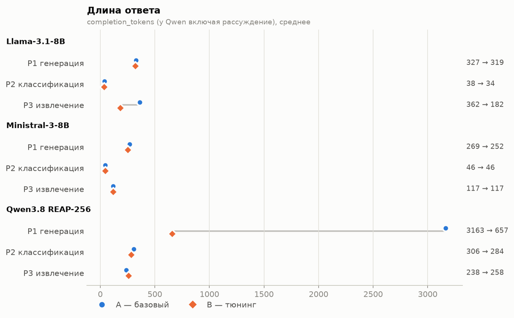
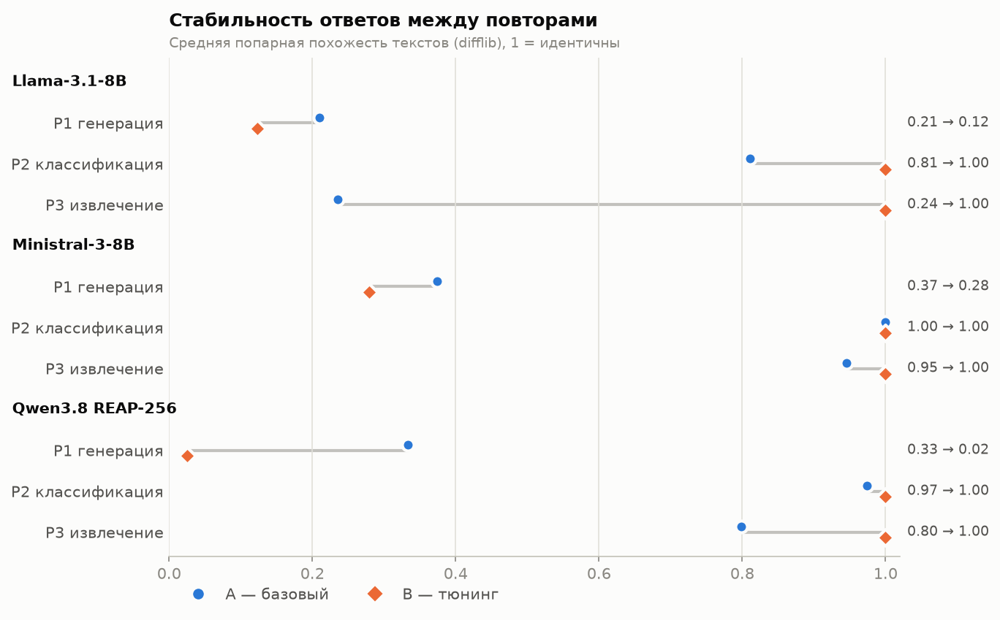

# Лабораторная работа №1 — Развёртывание и эмпирический анализ LLM

## Описание задания

Развернуть три LLM из разных семейств (Qwen, Llama, Mistral) с OpenAI-совместимым REST API,
прогнать на каждой три разнотипных промпта на русском языке (генерация, классификация,
извлечение) в двух режимах — **A (базовый, дефолты движка)** и **B (тюнинг гиперпараметров)** —
и провести эмпирический анализ: длина ответа, точность, стабильность, повторяемость,
галлюцинации, время отклика, число токенов, скорость токенизации и генерации.
Дополнительно — 8 задач по программированию на английском языке с автоматической проверкой
скрытыми тестами для детерминированного рейтинга моделей.

## Использованные технологии и модели

**Железо:** AMD Ryzen 9 9950X (16C/32T), 64 GB DDR5-6000, NVIDIA RTX 5070 12 GB, NVMe SSD.

**Движок:** [llama.cpp](https://github.com/ggml-org/llama.cpp) `llama-server` b11524 (CUDA 12.8),
OpenAI-совместимый endpoint `POST /v1/chat/completions`.

| Семейство | Модель | Квантование | Размер | Где лежат веса |
|---|---|---|---|---|
| Qwen | Qwen3.8-Flash-Next **REAP-256** — MoE 116.5B, 512 → 256 экспертов, top-10 + 1 shared | UD-Q3_K_XL (Unsloth Dynamic, ~3 бит) | 57.7 GiB | GPU: плотные веса + эксперты 5 слоёв; RAM: эксперты 43 слоёв; SSD (mmap): `per_layer_token_embd` |
| Llama | Llama-3.1-8B-Instruct | Q4_K_M | 4.6 GiB | целиком на GPU |
| Mistral | Ministral-3-8B-Instruct-2512 | Q4_K_M | 4.8 GiB | целиком на GPU |

**Python:** стандартная библиотека (`urllib`) для REST-клиента, анализа и оценки;
`matplotlib` — графики, `pytest` — тесты оценщиков.

## Параметры запуска

### Сервер

```bash
# Qwen3.8-Flash-Next REAP-256 (MoE, эксперты частично в RAM)
llama-server -m qwen38/Qwen3.8-Flash-Next-UD-Q3_K_XL-reap256-00001-of-00002.gguf \
  -c 16384 --parallel 1 -fa on --fit on -t 12 \
  --chat-template-kwargs '{"reasoning_effort":"low"}'

# Llama-3.1-8B-Instruct и Ministral-3-8B-Instruct (целиком на GPU)
llama-server -m llama31-8b/Meta-Llama-3.1-8B-Instruct-Q4_K_M.gguf     -c 8192 -ngl 99 -fa on
llama-server -m ministral3-8b/Ministral-3-8B-Instruct-2512-Q4_K_M.gguf -c 8192 -ngl 99 -fa on
```

| Флаг | Значение | Зачем |
|---|---|---|
| `--fit on` | авто-раскладка под свободную VRAM | `llama-fit-params` вычислил: все плотные веса и эксперты слоёв 0–4 (и часть 5-го) на GPU (~10.5 GB), эксперты 43 слоёв — в RAM |
| `-t 12` | 12 CPU-потоков | подобрано `llama-bench` (`results/bench_threads.md`): 8 → 31.0, **12 → 33.3**, 16 → 32.1 ток/с |
| mmap (по умолчанию) | без `--mlock` / `--no-mmap` | n-gram таблица `per_layer_token_embd` (26.8 GiB) читается по нескольку строк на токен и подкачивается с NVMe по требованию |
| `-fa on` | Flash Attention | меньше памяти под KV-кэш и выше скорость |
| `-c` | 16384 (Qwen), 8192 (8B) | контекст с запасом под рассуждения Qwen; KV-кэш Qwen мал — только 12 из 48 слоёв с полным вниманием, 2 KV-головы |
| `--parallel 1` | один слот | однопользовательский замер, весь контекст одному запросу |
| `reasoning_effort` | `low` (только Qwen) | параметр шаблона чата, одинаков в A и B; по умолчанию `xhigh` — минуты рассуждений на запрос |

**Как Qwen на 116B параметров помещается в 12 GB VRAM + 64 GB RAM.** REAP-прунинг оставляет
половину экспертов, квантование ~3 бит сжимает модель до 57.7 GiB. Почти половина файла — таблица
эмбеддингов `per_layer_token_embd` (26.8 GiB, 160 × 320M строк): на токен из неё читаются лишь
несколько строк, поэтому она остаётся на SSD. Рабочий набор — ~26 GiB экспертов (RAM + VRAM) и
~4 GiB плотных весов (GPU). Генерация упирается в пропускную способность DDR5 (~1.25 GB весов
экспертов на токен).

### Сэмплинг: режим A против режима B

| Параметр | A — базовый (дефолт) | B — P1 генерация | B — P2 / P3 структурные | B — C1–C8 код |
|---|---|---|---|---|
| `temperature` | 0.8 (Qwen: **1.0** из GGUF) | **0.7** | **0** | **0** |
| `top_p` | 0.95 | **0.9** | **1.0** | **1.0** |
| `top_k` | 40 (Qwen: **20** из GGUF) | 40 | **1** | **1** |
| `min_p` | 0.05 | 0.05 | 0.05 | 0.05 |
| `repeat_penalty` | 1.0 | **1.1** | 1.0 | 1.0 |
| `max_tokens` | без лимита (до конца контекста) | **1024** | **1024** | **8192** |

В режиме A в запросе нет ни одного параметра сэмплинга — действуют дефолты `llama-server`; Qwen
дополнительно берёт рекомендованные значения из метаданных своего GGUF. Изменённые в режиме B
значения выделены. Кэш префикса отключён (`cache_prompt: false`), перед замерами — прогревочный
запрос.

## Методика

### Задачи

- **P1 — генерация (рус.):** вежливое письмо клиенту о задержке заказа № 48213 на 3 рабочих дня,
  промокод SORRY10 (10 %, до 31 декабря), e-mail поддержки, 120–180 слов, без выдуманных фактов,
  подпись «Команда ТехноМир».
- **P2 — классификация (рус.):** 9 коротких обращений → метки `["Billing", "Tech support", "Sales"]`,
  ответ — только JSON-массив; есть эталонная разметка.
- **P3 — извлечение (рус.):** описание смартфона → JSON из 10 полей; ловушки: «1 год» → 12 месяцев,
  вес в тексте отсутствует (`null`, любое число — галлюцинация).
- **C1–C8 — программирование (англ.):** 8 задач на Python по возрастанию сложности
  (`source/code_tasks.py`): палиндром, слияние интервалов, римские числа, топ-k слов с тай-брейком,
  декодирование `k[...]`, самая длинная корректная скобочная подстрока, минимальное окно и
  **калькулятор выражений** (приоритеты, скобки, унарный минус, деление с усечением к нулю на каждом
  шаге, без `eval`). Модель возвращает функцию; оценка — доля пройденных скрытых тестов (5–11 на
  задачу). Код запускается в отдельном процессе `python3 -I` с лимитами времени (10 с), памяти
  (1 GiB) и CPU. Тесты проверены эталонными решениями (`source/test_code_eval.py`).

P1–P3: каждая комбинация модель × задача × режим — **3 повтора** (54 ответа). C1–C8: **один прогон**
на режим (48 ответов) — в режиме B декодирование жадное и детерминированное, рейтинг воспроизводим.

### Метрики (`source/analyze.py`, `source/judge.py`, `source/code_eval.py`)

| Метрика | Источник |
|---|---|
| Токены ввода / вывода | `usage.prompt_tokens / completion_tokens` (у Qwen — вместе с рассуждением) |
| Время отклика | wall-clock полного запроса; разбивка — `timings.prompt_ms / predicted_ms` |
| Скорость prefill / генерации | `timings.prompt_per_second / predicted_per_second` llama-server |
| Скорость токенизации | отдельный `POST /tokenize` по тексту промпта |
| Точность (авто) | P1 — 7 проверок фактов и длины; P2 — доля верных меток; P3 — доля верных полей; C — доля тестов |
| Точность / галлюцинации (LLM-судья) | слепая оценка 1–5 по критериям задачи + флаг `hallucination` |
| Стабильность | число уникальных ответов из 3 и средняя попарная похожесть (difflib) |
| Повторяемость внутри ответа | доля повторяющихся словесных 3-грамм в ответе (`rep3`) и в рассуждении (`rep3_r`) |

**LLM-as-a-judge.** Ответы всех моделей на P1–P3 перемешаны и обезличены (`results/judge/*.md`),
судья оценивает их без информации о модели и режиме; соответствие id → прогон хранится в
`mapping.json` и применяется только при сведении (`judge.py report`). Для P2 судья сначала размечает
обращения сам — его разметка совпала с эталонной 9/9.

## Результаты работы

### Итоги

| Модель | Режим | P1 письмо, судья | P2 классиф., судья | P3 извлеч., судья | Код: решено из 8 | Генерация, ток/с | Prefill, ток/с | Время ответа, с |
|---|---|---|---|---|---|---|---|---|
| Llama-3.1-8B | A | 2.0 | 3.0 | 3.0 | 5 | **108** | 4 282 | 2.3 |
| Llama-3.1-8B | B | **3.0** | 2.0 | 3.0 | 5 | 107 | 4 338 | 1.7 |
| Ministral-3-8B | A | **3.0** | 4.0 | 4.0 | 6 | 99 | **4 376** | **1.6** |
| Ministral-3-8B | B | **3.0** | 4.0 | 4.0 | **7** | 98 | 4 371 | **1.6** |
| Qwen3.8 REAP-256 | A | 1.0 | **5.0** | **4.3** | **7** | 35 | 186 | 36.9 |
| Qwen3.8 REAP-256 | B | 1.3 | **5.0** | 4.0 | 6 | 34 | 187 | 13.1 |

Оценка судьи — overall 1–5, среднее по 3 повторам; время и скорость — по задачам P1–P3.

- **Лучший баланс — Ministral-3-8B:** стабильно 3–4 балла на русских задачах, лучший результат на
  коде в режиме B (7/8), ~100 ток/с.
- **Qwen3.8 REAP-256 — лучшая на структурных задачах** (классификация 5.0, извлечение 4.0–4.3, код
  7/8 в режиме A), но **не способна написать текст на русском** (1.0–1.3) и в 3 раза медленнее.
- **Llama-3.1-8B — самая быстрая и самая слабая:** систематическая ошибка в классификации, слабый
  русский язык, 5/8 на коде.


### Скорость

| Модель | Генерация, ток/с | Prefill, ток/с | Токенизация, ток/с | Время `/tokenize`, мс | Вход P1, токенов |
|---|---|---|---|---|---|
| Llama-3.1-8B | 107.6 | 4 310 | ~250 000 | 0.9 | 207 |
| Ministral-3-8B | 98.5 | 4 374 | ~195 000 | 1.2 | 717 |
| Qwen3.8 REAP-256 | 34.3 | 186 | ~203 000 | 1.0 | 209 |


- Модели 8B целиком на GPU: ~100 ток/с генерации и ~4.3k ток/с prefill. Режим почти не влияет на
  скорость — она определяется размещением весов, а не сэмплингом.
- Время ответа почти целиком — генерация (оранжевый), prefill занимает доли секунды. У Qwen время
  определяется длиной рассуждения: P1 в режиме A — 92 с, в режиме B — 21 с; код — 84 и 53 с в среднем.
- Qwen генерирует в ~3 раза медленнее (эксперты 43 слоёв считаются на CPU), а prefill в ~23 раза
  медленнее: на коротких промптах (~250 токенов) он упирается в CPU-экспертов. В `llama-bench`
  на 256 токенах prefill — ~400 ток/с.
- Токенизация занимает ~1 мс на промпт (основная часть — HTTP-накладные), то есть пренебрежимо мала.
- У Ministral в 3.5 раза больше входных токенов: шаблон чата добавляет длинный системный промпт.

### Качество на русскоязычных задачах

| Модель | Режим | P1 авто | P1 судья | P2 авто | P2 судья | P3 авто | P3 судья | Галлюцинации P1 |
|---|---|---|---|---|---|---|---|---|
| Llama-3.1-8B | A | 0.95 | 2.0 | 0.78 | 3.0 | 0.67 | 3.0 | 2 / 3 |
| Llama-3.1-8B | B | **1.00** | **3.0** | 0.56 | 2.0 | **1.00** | 3.0 | 1 / 3 |
| Ministral-3-8B | A | 0.81 | **3.0** | **1.00** | 4.0 | **1.00** | 4.0 | 1 / 3 |
| Ministral-3-8B | B | 0.81 | **3.0** | **1.00** | 4.0 | **1.00** | 4.0 | 1 / 3 |
| Qwen3.8 REAP-256 | A | 0.00 | 1.0 | **1.00** | **5.0** | 0.97 | **4.3** | 0 / 3 |
| Qwen3.8 REAP-256 | B | 0.33 | 1.3 | **1.00** | **5.0** | **1.00** | 4.0 | 0 / 3 |

Авто — доля пройденных проверок (0–1); судья — overall (1–5), среднее по 3 повторам.

**P1 — генерация.**
- **Llama:** автопроверки проходят почти всегда (0.95–1.00), но судья находит пропуск срока
  «3 рабочих дня» в 3 из 6 писем (в одном — плейсхолдер `[предполагаемая дата поставки]`) и слабый
  язык: англицизмы (`slightly`, `SMALL`, `soon`), ошибки согласования. В режиме A чаще выдумывает
  детали: условие «покупка от 1000 рублей», обещание, что «подобное не повторится» (галлюцинации
  в 2 из 3 писем против 1 из 3 в режиме B).
- **Ministral:** лучший тон и грамотность, но в 5 из 6 писем искажено название магазина:
  `Техн[TOOL_CALLS]�ир`, `Технчиер`, `Техномври`, `Техновин`. В выход протекает служебный токен
  `[TOOL_CALLS]` и битый UTF-8, причём в обоих режимах — это дефект токенизации кириллицы
  квантованной модели, а не сэмплинга. Однажды вместо срока доставки — плейсхолдер
  `[уточняемая дата]`, однажды искажено имя клиента («Петровна»).
- **Qwen:** провал в обоих режимах — ни одного письма на русском. 3 из 6 ответов пустые, остальные —
  испанский текст или черновики рассуждений («Wait — I need to rewrite this entirely in Russian»,
  «NO NO NO. RUSSIAN. Cyrillic alphabet.»). Модель понимает задачу (рассуждение на английском
  верно перечисляет факты), но не может генерировать русский текст.

**P2 — классификация.**
- **Qwen и Ministral:** 9/9 во всех прогонах.
- **Llama:** при `temperature=0` (режим B) все 3 ответа одинаково неверны — 10 меток на 9 обращений
  по шаблону «Billing → Tech support → Sales» (5/9). В режиме A один из трёх ответов верный.
  Жадное декодирование не исправляет систематическую ошибку, а делает её воспроизводимой.

**P3 — извлечение.**
- Все модели правильно ставят `weight_g: null` и пересчитывают «1 год» в 12 месяцев — галлюцинаций
  значений нет.
- **Llama:** в режиме A один ответ — Python-скрипт с регулярными выражениями вместо JSON (к тому же
  нерабочий), длина ответа вдвое больше (362 против 182 токенов). Режим B даёт 3/3 верных JSON, но
  судья снижает оценку за пояснения после JSON (нарушение «верни ТОЛЬКО JSON»).
- **Qwen:** один ответ режима A со сменой языка в значении: `"color": "марсианский orange"`.

### Длина ответа, стабильность, зацикливание




- **Длина.** Тюнинг сокращает ответ там, где модель в режиме A «болтает»: Llama P3 362 → 182
  токена; Qwen P1 3163 → 657 токенов (92 → 21 с). На структурных задачах длина почти не меняется.
- **Стабильность.** При `temperature=0` все модели на P2/P3 дают 1 уникальный ответ из 3 (похожесть
  1.00). В режиме A похожесть Llama падает до 0.24–0.81; Ministral и в базовом режиме почти
  детерминирован (0.95–1.00). На P1 тексты разнообразны в обоих режимах (0.02–0.37) — это ожидаемо
  для творческой задачи.
- **Зацикливание.** В ответах моделей повторов нет (`rep3` < 0.05 на P1; на P2 повтор меток —
  естественный). Но у Qwen в режиме A зацикливается **рассуждение**: `rep3_r = 0.53`, в логах —
  сотни повторов «I'll write "Иnfractions"» и «Actually, let me use "U."? Hmm.». В режиме B
  (`repeat_penalty=1.1`, `max_tokens=1024`) `rep3_r` падает до 0.14, но один прогон обрывается
  по лимиту токенов без ответа.

### Программирование на английском (C1–C8)

Все прогоны: `source/results/code_runs.jsonl`, результаты тестов: `source/results/code_scores.jsonl`,
сводка: `source/results/code_summary.md`.

| Место (B) | Модель | Решено, B | Решено, A | Тестов пройдено, B | Тестов пройдено, A | Генерация, ток/с | Prefill, ток/с | Среднее время, с |
|---|---|---|---|---|---|---|---|---|
| 1 | Ministral-3-8B | **7 / 8** | 6 / 8 | **91 %** | 77 % | 105.6 | 4 636 | 1.8 |
| 2 | Qwen3.8 REAP-256 | 6 / 8 | **7 / 8** | 75 % | **88 %** | 34.8 | 113 | 68.7 |
| 3 | Llama-3.1-8B | 5 / 8 | 5 / 8 | 72 % | 78 % | **115.8** | 3 979 | **1.5** |

По сумме двух режимов Qwen и Ministral делят первое место (13 из 16), Llama — третья (10 из 16).


- **C8 калькулятор не решила ни одна модель** — задача отделяет уровень моделей. Ministral (B)
  проходит 3/11 тестов, Llama (B) — 2/11 (например, `14-3/2` → 14 вместо 13), в режиме A обе падают
  с `IndexError: pop from empty list` на первом же примере. Qwen ни разу не выдаёт код: в режиме A
  рассуждение зацикливается («Multiplication by: multiply…», `rep3_r = 0.65`) и съедает весь
  контекст 16k (470 с); в режиме B рассуждение не застревает в одной фразе (`rep3_r = 0.39`) и верно разбирает
  усечение к нулю, но не укладывается даже в 8192 токена (237 с).
- **Ministral** — лучшая в режиме B. В режиме A проваливает `decode_string` (1/6: не обрабатывает
  вложенность — `3[a2[c]]` → `acac`); при `temperature=0` решает её полностью.
- **Qwen** в режиме A решает 7 из 8 — лучший результат, но ценой времени: на `int_to_roman` —
  5 167 токенов рассуждения (151 с). В режиме B на этой задаче модель сначала упиралась в
  `max_tokens=2048` (рассуждение перечисляло римские числа подряд, с ошибками: «190: CM»); после
  увеличения лимита до 8192 она сама завершила генерацию через 4 143 токена посреди рассуждения
  («Wait, I need») — без кода. Это отказ модели, а не ограничение лимита.
- **Llama** ошибается в `top_k_frequent_words` в обоих режимах: в A сортирует слова только по
  алфавиту, игнорируя частоту; в B переворачивает порядок при равных частотах (`["love", "i"]`).
  При `temperature=0` пишет нерабочий `decode_string` (возвращает пустую строку), в режиме A падает
  на `min_window` (`KeyError` на символах вне `t`). Температура меняет, какие задачи решены, но не
  общий уровень.
- **Скорость** на коротких английских промптах (~125 токенов у Llama и Qwen) та же, что на русских
  задачах. У Ministral вход снова в 5 раз длиннее (625 токенов) из-за системного промпта шаблона.
- **Рейтинг отличается от русскоязычных задач:** на коде с английским промптом Qwen сильна, а её
  проблемы с русским — именно языковые; Ministral, искажающая кириллицу, на коде — лучшая.

## Выводы

1. **Влияние гиперпараметров зависит от задачи.** Для структурных задач (P2, P3) `temperature=0` +
   `top_k=1` дают детерминизм и устраняют «дрейф» формата (Python-код вместо JSON, лишний текст),
   но закрепляют систематические ошибки (Llama P2: стабильно 5/9). Для генерации умеренная
   температура и `repeat_penalty` слабо влияют на качество текста, но заметно сокращают
   галлюцинации у Llama и длину рассуждений у Qwen.
2. **`max_tokens` — главный рычаг для reasoning-модели.** Без лимита Qwen на P1 тратит до 5 500
   токенов (159 с) и зацикливается; лимит 1024 сокращает время в 4.5 раза, но может оборвать
   ответ. На трудной задаче (C8) не помогает и 8192 — бюджет рассуждения нужно подбирать под задачу.
3. **Крупная модель не гарантирует качество на русском.** Qwen3.8 REAP-256 — лучшая на
   классификации и извлечении, но не способна написать русский текст. Вероятная причина —
   прунинг: значимость экспертов REAP оценивалась на коде и агентных задачах, поэтому эксперты,
   отвечающие за русский язык, могли быть удалены; на это же указывает смена языка в значении
   поля P3. Для русскоязычной генерации нужна полная (или откалиброванная на русском) версия.
4. **Квантованная Ministral портит кириллицу** (служебный токен `[TOOL_CALLS]` и битый UTF-8 в
   названии магазина) независимо от сэмплинга; автоматическая проверка ловит это не всегда —
   регистронезависимое сравнение пропускает частично искажённые варианты, судья — нет.
5. **Автоматические метрики и LLM-судья дополняют друг друга.** Авто-проверки надёжно ловят
   факты, формат и метки, но завышают качество писем (Llama P1: 0.95–1.00 при оценке судьи 2–3)
   — они не видят пропущенного срока, выдуманных условий, англицизмов и неуместного тона.
6. **Производительность.** На RTX 5070 модели 8B дают ~100 ток/с; MoE-модель 116B с экспертами
   в RAM — 34 ток/с генерации при ~190 ток/с prefill. Узкие места — пропускная способность DDR5
   для генерации и CPU-эксперты для prefill; токенизация (~1 мс) на скорость не влияет.
7. **На программировании рейтинг детерминирован и не совпадает с русскоязычным:** в режиме B
   Ministral-3-8B (7/8) > Qwen3.8 REAP-256 (6/8) > Llama-3.1-8B (5/8). Для небольших моделей
   `temperature=0` скорее помогает (Ministral +1 задача), reasoning-модель без лимита решает больше,
   но на трудных задачах рискует зациклиться или не уложиться в бюджет токенов.

## Инструкция по запуску

1. Скачать llama.cpp b11524 (`llama-b11524-bin-ubuntu-cuda-12.8-x64.tar.gz` и
   `cudart-llama-b11524-bin-ubuntu-cuda-12.8-x64.tar.gz` из
   [релизов](https://github.com/ggml-org/llama.cpp/releases/tag/b11524)) и распаковать оба архива
   в `~/llms/llama.cpp/llama-b11524/`.
2. Скачать модели в `~/llms/models/` (пути — в `source/config.py`):
   - `AnonimousA/Qwen3.8-Flash-Next-REAP-256-duo-GGUF` → `qwen38/` (оба шарда);
   - `bartowski/Meta-Llama-3.1-8B-Instruct-GGUF`, файл Q4_K_M → `llama31-8b/`;
   - `mistralai/Ministral-3-8B-Instruct-2512-GGUF`, файл Q4_K_M → `ministral3-8b/`.
3. Окружение (из корня репозитория):
   ```bash
   python3 -m venv .venv && source .venv/bin/activate
   pip install -r projects/an-volosevich/lab1/source/requirements.txt
   cd projects/an-volosevich/lab1/source
   ```
4. Тесты оценщиков и эталонные решения задач на код: `python -m pytest -q`.
5. Прогоны (каждая модель поднимается и останавливается автоматически):
   ```bash
   python run_bench.py                 # P1–P3: results/runs.jsonl, 3 повтора
   python run_code.py                  # C1–C8: results/code_runs.jsonl, выполненные прогоны пропускаются
   ./bench_threads.sh                  # опционально: подбор числа потоков для Qwen
   ```
6. Анализ и графики:
   ```bash
   python analyze.py                   # results/summary.md, results/auto_scores.jsonl
   python judge.py prepare             # results/judge/<prompt>.md — обезличенные ответы для судьи
   # оценки судьи записываются в results/judge/scores.jsonl
   python judge.py report              # results/judge/report.md
   python code_eval.py                 # results/code_scores.jsonl, results/code_summary.md
   python visualize.py                 # results/plots/*.png
   ```
