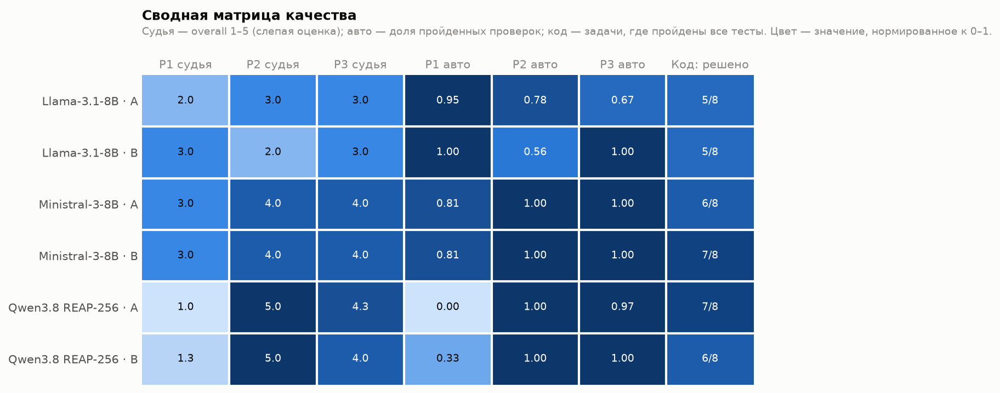
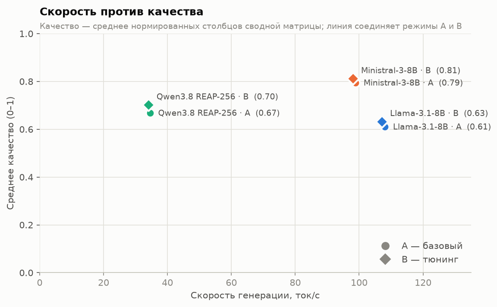
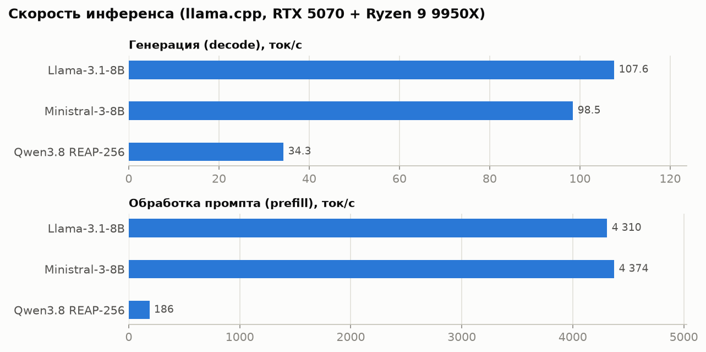
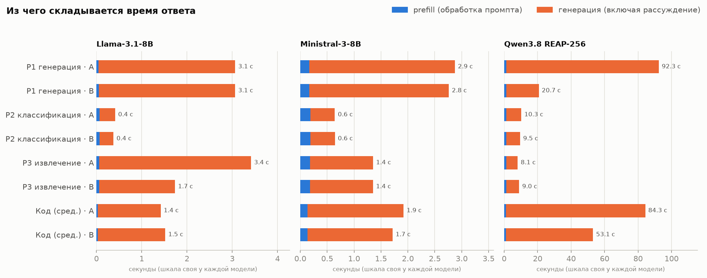
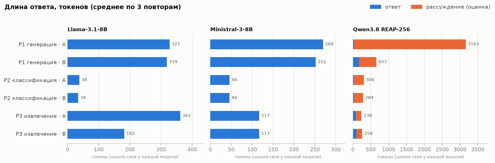
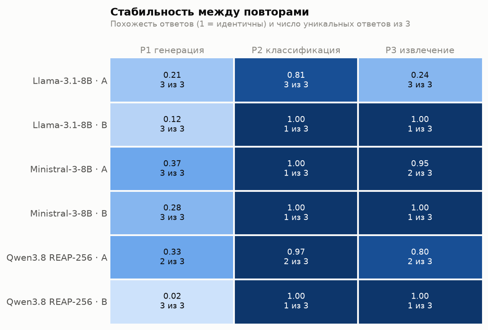
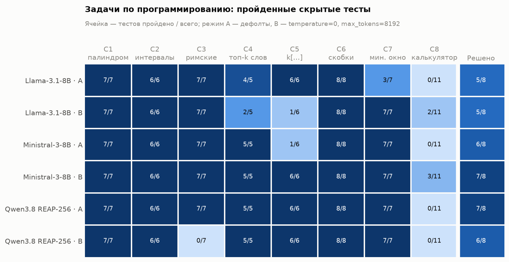

# Лабораторная работа №1 — Развёртывание и эмпирический анализ LLM

## Описание задания

Три LLM из разных семейств (Qwen, Llama, Mistral) развёрнуты с OpenAI-совместимым REST API и
протестированы на трёх задачах на русском языке (генерация, классификация, извлечение) в двух
режимах: **A** — дефолты движка, **B** — тюнинг гиперпараметров. Дополнительно — 8 задач по
программированию на английском с проверкой скрытыми тестами.

## Использованные технологии и модели

**Железо:** Ryzen 9 9950X, 64 GB DDR5-6000, RTX 5070 12 GB, NVMe SSD.

### Инструменты развёртывания

| Инструмент | Назначение |
|---|---|
| **llama.cpp b11524**, сборки `ubuntu-cuda-12.8-x64` + `cudart` | готовые бинарники с CUDA-рантаймом: без сборки, CUDA Toolkit и root; CUDA 12.8 поддерживает Blackwell (RTX 50xx) |
| `llama-server` | OpenAI-совместимый REST: `/v1/chat/completions`, `/tokenize`, `/health`; шаблоны чата (Jinja) из GGUF, рассуждение Qwen — в `reasoning_content` |
| `llama-fit-params`, `--fit` | расчёт раскладки весов MoE между VRAM и RAM |
| `llama-bench` | подбор числа CPU-потоков |
| GGUF с Hugging Face | Unsloth Dynamic (Qwen), bartowski (Llama), официальный mistralai (Ministral) |
| Python 3.14 + venv | клиент на `urllib`, песочница для кода (`subprocess` + `resource`), `matplotlib`, `pytest` |

llama.cpp выбран из-за модели на 116B: он считает часть экспертов MoE на CPU прямо из RAM
(`--fit` / `--n-cpu-moe`) и держит таблицу эмбеддингов на SSD через mmap. vLLM и SGLang рассчитаны
на веса в VRAM — их выгрузка в RAM лишь подкачивает веса на GPU и для такой модели слишком медленна.

### Модели

| Семейство | Модель | Квантование | Размер | Размещение |
|---|---|---|---|---|
| Qwen | Qwen3.8-Flash-Next **REAP-256** (MoE 116.5B, 256 из 512 экспертов) | UD-Q3_K_XL | 57.7 GiB | GPU + RAM + SSD |
| Llama | Llama-3.1-8B-Instruct | Q4_K_M | 4.6 GiB | GPU |
| Mistral | Ministral-3-8B-Instruct-2512 | Q4_K_M | 4.8 GiB | GPU |

## Параметры запуска

```bash
llama-server -m qwen38/Qwen3.8-Flash-Next-UD-Q3_K_XL-reap256-00001-of-00002.gguf \
  -c 16384 --parallel 1 -fa on --fit on -t 12 --chat-template-kwargs '{"reasoning_effort":"low"}'
llama-server -m llama31-8b/Meta-Llama-3.1-8B-Instruct-Q4_K_M.gguf     -c 8192 -ngl 99 -fa on
llama-server -m ministral3-8b/Ministral-3-8B-Instruct-2512-Q4_K_M.gguf -c 8192 -ngl 99 -fa on
```

- **`--fit on`** — плотные веса и эксперты слоёв 0–4 на GPU (~10.5 GB), эксперты 43 слоёв в RAM.
- **mmap** — таблица `per_layer_token_embd` (26.8 GiB, 46 % файла) читается по нескольку строк на
  токен и остаётся на SSD; в RAM активно ~22 GiB экспертов.
- **`-t 12`** — по `llama-bench`: 8 → 31.0, **12 → 33.3**, 16 → 32.1 ток/с.
- **`reasoning_effort: low`** — параметр шаблона чата (не сэмплинга), одинаков в A и B.

| Параметр | A (дефолт) | B: P1 | B: P2, P3 | B: код |
|---|---|---|---|---|
| `temperature` | 0.8 (Qwen 1.0) | **0.7** | **0** | **0** |
| `top_p` | 0.95 | **0.9** | **1.0** | **1.0** |
| `top_k` | 40 (Qwen 20) | 40 | **1** | **1** |
| `repeat_penalty` | 1.0 | **1.1** | 1.0 | 1.0 |
| `max_tokens` | без лимита | **1024** | **1024** | **8192** |

Значения Qwen в режиме A — из метаданных GGUF. `cache_prompt: false`, перед замерами — прогрев.
Отдельный эксперимент **B_long** (только Qwen, C3 и C8): параметры B, контекст 65 536,
`max_tokens=32768`.

## Методика

- **P1** — письмо клиенту о задержке заказа: 9 фактов, 120–180 слов, без выдумок.
- **P2** — 9 обращений → `Billing` / `Tech support` / `Sales`, только JSON.
- **P3** — описание смартфона → JSON из 10 полей; ловушки: «1 год» → 12 мес., вес отсутствует (`null`).
- **C1–C8** — функции на Python: палиндром, интервалы, римские числа, топ-k слов, `k[...]`,
  скобки, минимальное окно, калькулятор выражений (без `eval`, деление с усечением к нулю).
  5–11 скрытых тестов на задачу, код исполняется в изолированном процессе с лимитами.

P1–P3 — 3 повтора (54 ответа), C1–C8 — один прогон на режим (48 ответов; в B декодирование
детерминировано). Качество P1–P3 оценивается автоматически (факты, метки, поля) и **слепым
LLM-судьёй** (1–5, ответы обезличены и перемешаны, `results/judge/`).

## Результаты работы

### Итоги

| Модель | Режим | P1 | P2 | P3 | Код | Генерация, ток/с | Prefill, ток/с | Ответ, с |
|---|---|---|---|---|---|---|---|---|
| Llama-3.1-8B | A | 2.0 | 3.0 | 3.0 | 5/8 | **108** | 4 282 | 2.3 |
| Llama-3.1-8B | B | **3.0** | 2.0 | 3.0 | 5/8 | 107 | 4 338 | 1.7 |
| Ministral-3-8B | A | **3.0** | 4.0 | 4.0 | 6/8 | 99 | **4 376** | **1.6** |
| Ministral-3-8B | B | **3.0** | 4.0 | 4.0 | **7/8** | 98 | 4 371 | **1.6** |
| Qwen3.8 REAP-256 | A | 1.0 | **5.0** | **4.3** | **7/8** | 35 | 186 | 36.9 |
| Qwen3.8 REAP-256 | B | 1.3 | **5.0** | 4.0 | 6/8 | 34 | 187 | 13.1 |

P1–P3 — оценка судьи (1–5); код — решённые задачи. Токенизация у всех ~1 мс на промпт
(~200–250 тыс. ток/с).

- **Ministral-3-8B** — лучший баланс качества и скорости.
- **Qwen3.8 REAP-256** — лучшая на классификации, извлечении и коде (A), но не пишет по-русски и
  в 3 раза медленнее при 12× большем объёме весов.
- **Llama-3.1-8B** — самая быстрая и самая слабая.




### Скорость




- Время ответа — почти целиком генерация; у Qwen оно определяется длиной рассуждения.
- Prefill Qwen в 23 раза медленнее, чем у 8B: короткие промпты упираются в CPU-экспертов.
- Шаблон Ministral добавляет системный промпт: на входе 717 токенов против 207 у Llama.

### Качество на русскоязычных задачах

- **P1.** Llama пропускает срок «3 рабочих дня» в 3 из 6 писем, пишет с англицизмами (`slightly`,
  `soon`) и в режиме A чаще выдумывает условия (галлюцинации 2/3 против 1/3 в B). Ministral пишет
  грамотнее, но в 5 из 6 писем портит название магазина: `Техн[TOOL_CALLS]�ир`, `Технчиер` — в обоих
  режимах. Qwen не написал ни одного письма: пустые ответы, испанский текст, обрывки рассуждений
  («NO NO NO. RUSSIAN. Cyrillic alphabet.»).
- **P2.** Qwen и Ministral — 9/9 всегда. Llama при `temperature=0` стабильно выдаёт 10 меток на
  9 обращений (5/9): жадное декодирование закрепляет ошибку.
- **P3.** Все модели верно ставят `weight_g: null` и 12 месяцев. Llama в режиме A однажды вернула
  Python-скрипт вместо JSON; Qwen — `"color": "марсианский orange"`.

### Длина ответа, стабильность, зацикливание




- Тюнинг сокращает ответы, где модель «болтает»: Llama P3 362 → 182 токена, Qwen P1 3163 → 657.
  У Qwen рассуждение занимает 63–98 % токенов.
- При `temperature=0` P2/P3 дают один и тот же ответ во всех повторах. Ministral почти
  детерминирован и в режиме A. «2 из 3» у Qwen P1 A — два одинаково пустых ответа.
- В рассуждениях Qwen (режим A) — петли: 53 % повторяющихся 3-грамм, сотни повторов
  «I'll write "Иnfractions"». В режиме B — 14 %.

### Программирование на английском (C1–C8)

| Модель | Решено, B | Решено, A | Тесты, B | Тесты, A | Генерация, ток/с | Prefill, ток/с | Ответ, с |
|---|---|---|---|---|---|---|---|
| Ministral-3-8B | **7/8** | 6/8 | **91 %** | 77 % | 105.6 | 4 636 | 1.8 |
| Qwen3.8 REAP-256 | 6/8 | **7/8** | 75 % | **88 %** | 34.8 | 113 | 68.7 |
| Llama-3.1-8B | 5/8 | 5/8 | 72 % | 78 % | **115.8** | 3 979 | **1.5** |



- **C8 (калькулятор) не решила ни одна модель.** Ministral и Llama в B проходят 3/11 и 2/11, в A
  падают на первом примере. Qwen кода не выдаёт: в A рассуждение зацикливается и заполняет весь
  контекст 16k (470 с), в B не укладывается в 8192 токена.
- **Qwen C3 в режиме B:** модель сама прекращает генерацию посреди рассуждения («Wait, I need»)
  через 4 143 токена, без кода.
- **Llama** ошибается в сортировке `top_k_frequent_words` в обоих режимах; температура меняет, какие
  задачи решены, но не их число.
- **Ministral** в A не справляется с вложенностью `k[...]` (`3[a2[c]]` → `acac`), в B решает.
- **B_long (контекст 65k, 32 768 токенов):** Qwen решает C3 (7/7, 1 109 токенов, 34 с), но не C8:
  16 минут рассуждений с верным решением, но без кода — модель зацикливается на перепроверке
  («OK, I think the implementation is correct… Actually, let me also think…», 81 % повторяющихся
  3-грамм).
- **Детерминизм зависит от конфигурации.** C3 в B и B_long при одинаковом сэмплинге дали разный
  результат (4 143 токена без кода против 1 109 с верным кодом): контекст 65k меняет раскладку
  весов GPU/CPU, а с ней — численные результаты. `temperature=0` воспроизводим только при той же
  конфигурации запуска.

## Выводы

1. **Эффект гиперпараметров зависит от задачи.** `temperature=0` даёт детерминизм и убирает дрейф
   формата на структурных задачах, но закрепляет систематические ошибки (Llama P2). На генерации
   тюнинг снижает галлюцинации Llama и длину рассуждений Qwen.
2. **Для reasoning-модели главный параметр — `max_tokens`.** Без лимита Qwen тратит до 16 тыс.
   токенов и зацикливается; с лимитом — быстрее, но может не успеть ответить. Больший бюджет
   помогает не всегда: на C8 не хватило и 32 тыс. токенов — модель не может закончить перепроверку.
3. **REAP-прунинг, вероятно, сломал русский язык у Qwen:** значимость экспертов считалась на коде
   и агентных задачах, а на структурных задачах и коде модель остаётся сильной.
4. **Квантованная Ministral портит кириллицу** (служебные токены, битый UTF-8) независимо от
   сэмплинга.
5. **Авто-метрики завышают качество текста** (Llama P1: 0.95–1.00 против 2–3 у судьи) — для
   генерации нужен судья.
6. **Модель 8B на GPU (~100 ток/с) выгоднее 116B MoE с экспертами в RAM (34 ток/с)** — на этих
   задачах большая модель не окупает ресурсы.

## Инструкция по запуску

1. Скачать llama.cpp [b11524](https://github.com/ggml-org/llama.cpp/releases/tag/b11524)
   (`llama-…-ubuntu-cuda-12.8-x64` и `cudart-…-cuda-12.8-x64`) в `~/llms/llama.cpp/llama-b11524/`.
2. Скачать модели в `~/llms/models/` (пути — в `source/config.py`):
   `AnonimousA/Qwen3.8-Flash-Next-REAP-256-duo-GGUF` → `qwen38/`,
   `bartowski/Meta-Llama-3.1-8B-Instruct-GGUF` (Q4_K_M) → `llama31-8b/`,
   `mistralai/Ministral-3-8B-Instruct-2512-GGUF` (Q4_K_M) → `ministral3-8b/`.
3. Окружение и прогон (из корня репозитория):
   ```bash
   python3 -m venv .venv && source .venv/bin/activate
   pip install -r projects/an-volosevich/lab1/source/requirements.txt
   cd projects/an-volosevich/lab1/source
   python -m pytest -q          # тесты оценщиков и эталонные решения
   python run_bench.py          # P1–P3 → results/runs.jsonl
   python run_code.py           # C1–C8 → results/code_runs.jsonl
   python run_code.py --long --models qwen3.8-flash-next-reap256 --problems C3_int_to_roman C8_calculator
   python analyze.py            # results/summary.md
   python judge.py prepare      # обезличенные ответы для судьи → results/judge/
   python judge.py report       # после оценки: results/judge/report.md
   python code_eval.py          # results/code_summary.md
   python visualize.py          # results/plots/
   ```
